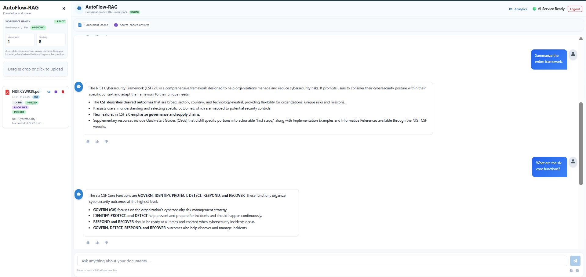
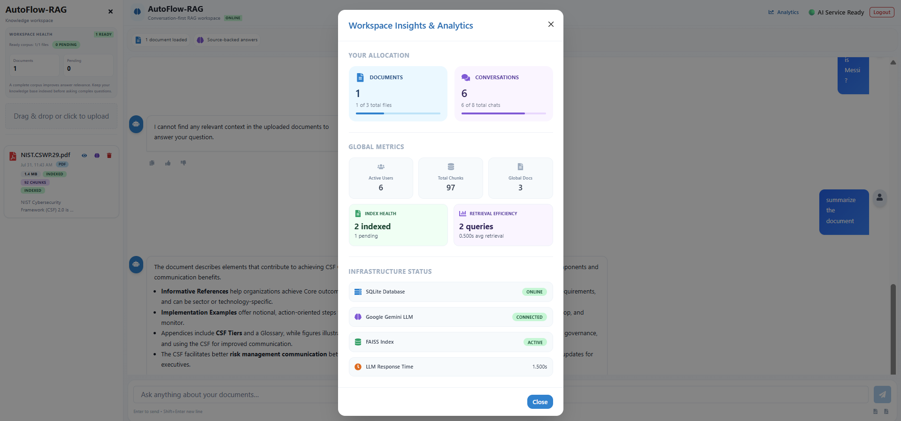
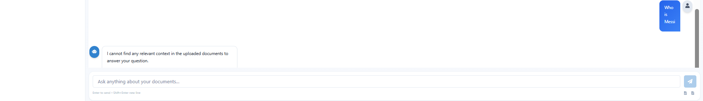
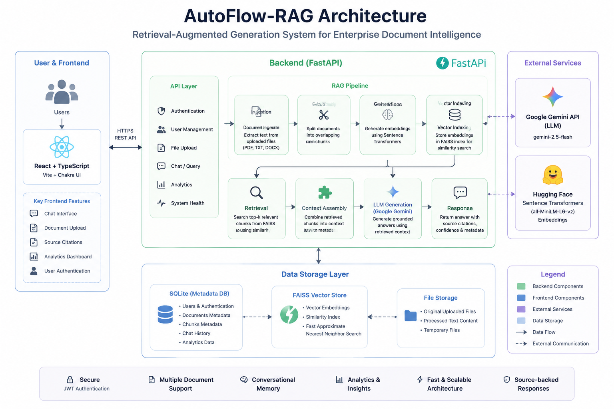

# 🚀 AutoFlow-RAG

> Enterprise Retrieval-Augmented Generation (RAG) platform for intelligent document search and grounded AI responses using **React, FastAPI, FAISS, and Google Gemini**.

<p align="center">


</p>

---

# 📖 Overview

AutoFlow-RAG is a production-ready Retrieval-Augmented Generation (RAG) platform that enables users to upload enterprise documents, build a semantic knowledge base, and receive accurate, source-backed AI responses.

The system combines **FastAPI**, **React**, **FAISS vector search**, **Sentence Transformer embeddings**, and **Google Gemini** to provide explainable, low-latency document intelligence while minimizing hallucinations.

---

# ✨ Key Features

- 📄 PDF & document upload
- 🧠 Automatic text chunking and embedding generation
- 🔍 Semantic search using FAISS
- 🤖 Google Gemini-powered grounded responses
- 📚 Source-backed answers with citations
- 📊 Analytics dashboard
- 📁 Document management
- 💬 Multi-turn conversational chat
- 🔐 JWT Authentication
- ⚡ FastAPI backend
- 🎨 Responsive React frontend
- 🛡️ Hallucination prevention using Retrieval-Augmented Generation

---

# 📸 Screenshots

## Chat Interface



---

## Analytics Dashboard



---

## Hallucination Prevention



---

## System Architecture



---

# 🏗️ Architecture

```text
                Upload Documents
                       │
                       ▼
            Text Extraction & Parsing
                       │
                       ▼
                 Text Chunking
                       │
                       ▼
          Sentence Transformer Embeddings
                       │
                       ▼
                 FAISS Vector Store
                       │
                       ▼
              Semantic Similarity Search
                       │
                       ▼
          Google Gemini (Grounded Prompt)
                       │
                       ▼
          Source-backed AI Response
```

---

# 🛠️ Tech Stack

## Frontend

- React
- TypeScript
- Vite
- Chakra UI
- Zustand

## Backend

- FastAPI
- SQLAlchemy
- JWT Authentication
- Pydantic

## AI & Retrieval

- Google Gemini
- FAISS
- LangChain
- Sentence Transformers

## Database

- SQLite

## DevOps

- Docker
- Docker Compose

---

# 📂 Project Structure

```text
AutoFlow-RAG
│
├── backend/
├── frontend/
├── data/
├── screenshots/
├── docker-compose.yml
├── README.md
└── LICENSE
```

---

# 🚀 Installation

## Clone Repository

```bash
git clone https://github.com/YOUR_USERNAME/AutoFlow-RAG.git

cd AutoFlow-RAG
```

---

## Backend

```bash
cd backend

python -m venv .venv

# Windows
.venv\Scripts\activate

# Linux/macOS
source .venv/bin/activate

pip install -r requirements.txt

uvicorn app.main:app --reload
```

---

## Frontend

```bash
cd frontend

npm install

npm run dev
```

---

## Docker

```bash
docker compose up --build
```

---

# ⚙️ Environment Variables

Backend `.env`

```env
GEMINI_API_KEY=your_api_key
JWT_SECRET_KEY=your_secret
CHAT_RAG_ADMIN_TOKEN=your_admin_token
```

Frontend `.env`

```env
VITE_ADMIN_TOKEN=your_admin_token
```

---

# 📊 Features

- Semantic document retrieval
- Explainable AI responses
- Source citations
- Analytics dashboard
- Chunk statistics
- Upload status
- Conversation history
- Multi-document search
- JWT authentication
- Responsive UI

---

# 🎯 Future Improvements

- OCR Support
- Image Retrieval
- Hybrid Search
- Cloud Storage Integration
- Multi-user Workspace
- Role-Based Access Control
- Streaming Responses
- Azure/OpenAI Support

---

# 📜 License

This project is licensed under the MIT License.

---

# 👨‍💻 Author

**Varun PV**

Computer Science Engineering Student

GitHub: (https://github.com/Varunpv2005)
