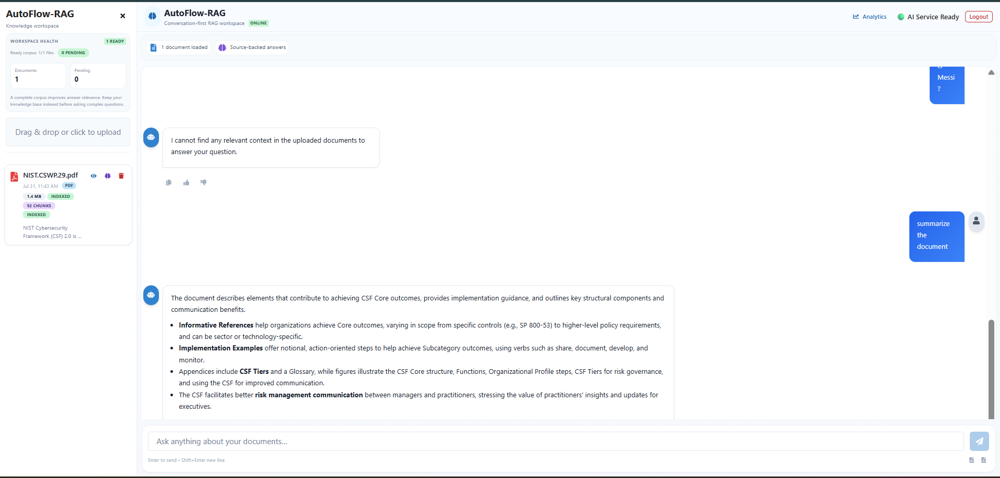
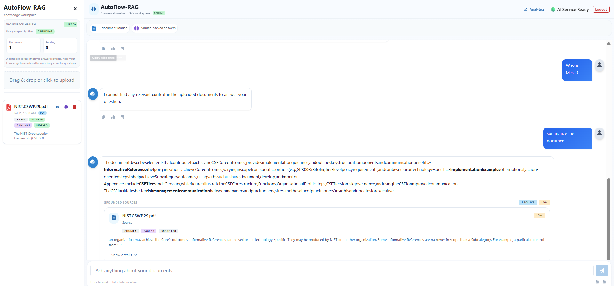
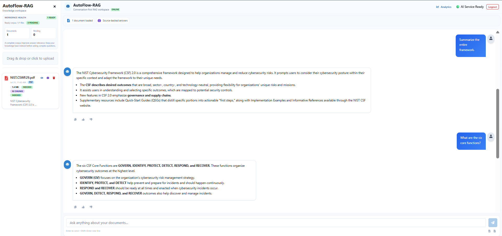
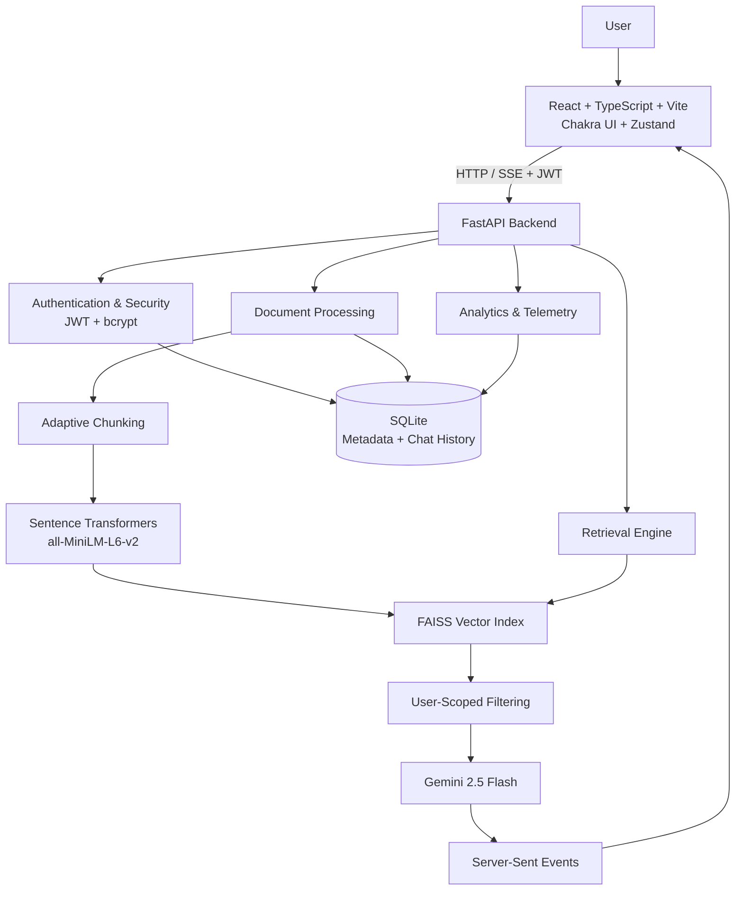
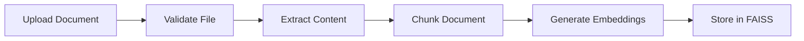
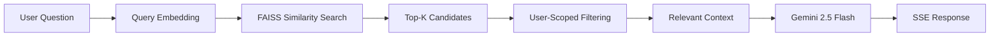

# AutoFlow-RAG — Autonomous AI Task Execution Engine

### AI-Powered Document Intelligence and Retrieval-Augmented Generation Platform

AutoFlow-RAG is a full-stack **Retrieval-Augmented Generation (RAG)** platform that allows users to upload documents, retrieve relevant information using semantic search, and interact with their documents through grounded AI conversations.

The system automates the complete document-to-answer pipeline:

**Upload → Parse → Chunk → Embed → Index → Retrieve → Filter → Generate → Stream**

It combines **React, FastAPI, FAISS, Sentence Transformers, Google Gemini 2.5 Flash, JWT authentication, SQLite, and Docker** into an end-to-end document intelligence application.

---

## 🚀 Product Overview

AutoFlow-RAG is designed around a simple idea:

> **Give the AI access to the user's documents, retrieve the most relevant evidence, and generate answers grounded in that evidence.**

The application provides:

- Document upload and indexing
- Semantic document retrieval
- Source-backed AI answers
- Retrieval similarity scores
- Page and chunk references
- User-scoped document isolation
- Persistent conversations
- Real-time AI response streaming
- Workspace analytics
- Infrastructure health monitoring

---

## 📸 Application

### Document Workspace



The workspace provides a centralized interface for:

- Uploading documents
- Monitoring indexing status
- Viewing document metadata
- Starting conversations
- Reviewing source-backed answers

---

### Grounded Answers & Sources



Each response can display its supporting source information, including:

- Source document
- Page number
- Retrieved chunk
- Similarity score
- Source relevance

This makes the retrieval process more transparent and easier to verify.

---

### Conversational Document Querying


Users can ask natural-language questions and continue the conversation using previously retrieved document context.

The system can also refuse questions when relevant information cannot be found in the uploaded documents rather than blindly generating an answer.

---

### Workspace Analytics



The analytics dashboard provides visibility into:

- Document allocation
- Conversation usage
- Total chunks
- Global documents
- Active users
- Index health
- Retrieval metrics
- Infrastructure status
- Gemini service status
- FAISS status
- Database status

---

# ✨ Key Features

### 📄 Multi-Format Document Processing

Supports:

- PDF
- DOCX
- TXT
- CSV
- XLSX

Documents are parsed, processed, chunked, embedded, and indexed automatically.

### 🧩 Adaptive Chunking

Documents are divided into retrieval-friendly chunks while maintaining metadata such as:

```text
user_id
document_id
filename
page_number
chunk_id
```

### 🔎 Semantic Retrieval

User questions are converted into embeddings and searched against the FAISS vector index to identify the most relevant document chunks.

### ⚡ Persistent FAISS Index

Embeddings are stored in a disk-persisted FAISS index so the vector store can survive backend restarts.

### 🔐 User-Scoped Retrieval

Retrieved chunks are associated with the authenticated user's identity.

```text
Authenticated User
        ↓
Vector Search
        ↓
Candidate Chunks
        ↓
User ID Filtering
        ↓
Authorized Context
```

This prevents cross-user document retrieval.

### 📊 Retrieval Transparency

Retrieved sources expose information such as:

```text
Document
Page
Chunk
Similarity Score
```

FAISS distance is converted into a normalized similarity representation:

```text
similarity = 1 / (1 + distance)
```

### 🤖 Grounded Gemini Responses

Relevant document context is supplied to **Gemini 2.5 Flash** to generate answers based on retrieved evidence.

The application is designed to avoid answering questions when the required information cannot be supported by the indexed documents.

### 💬 Persistent Conversations

Chat history is maintained so users can continue conversations and ask follow-up questions.

### ⚡ Real-Time Streaming

AI responses can be delivered incrementally using **Server-Sent Events (SSE)**.

```text
/api/chat/stream
```

### 📈 Workspace Analytics

The application provides workspace-level analytics and infrastructure visibility.

### 🐳 Containerized Deployment

The complete application can be run using Docker and Docker Compose.

---

# 🏗️ Architecture


```mermaid
flowchart TD

    USER[User]

    FE[React + TypeScript + Vite<br/>Chakra UI + Zustand]

    API[FastAPI Backend]

    AUTH[Authentication & Security<br/>JWT + bcrypt]

    DOC[Document Processing]

    CHUNK[Adaptive Chunking]

    EMB[Sentence Transformers<br/>all-MiniLM-L6-v2]

    FAISS[FAISS Vector Index]

    RET[Retrieval Engine]

    FILTER[User-Scoped Filtering]

    GEM[Gemini 2.5 Flash]

    SSE[Server-Sent Events]

    DB[(SQLite<br/>Metadata + Chat History)]

    ANALYTICS[Analytics & Telemetry]

    USER --> FE

    FE -->|HTTP / SSE + JWT| API

    API --> AUTH
    API --> DOC
    API --> RET
    API --> ANALYTICS

    DOC --> CHUNK
    CHUNK --> EMB
    EMB --> FAISS

    RET --> FAISS
    FAISS --> FILTER
    FILTER --> GEM

    GEM --> SSE
    SSE --> FE

    AUTH --> DB
    DOC --> DB
    ANALYTICS --> DB
```

---

# 🔄 RAG Pipeline

## Document Ingestion


```mermaid
flowchart LR

    A[Upload Document]
    B[Validate File]
    C[Extract Content]
    D[Chunk Document]
    E[Generate Embeddings]
    F[Store in FAISS]

    A --> B
    B --> C
    C --> D
    D --> E
    E --> F
```

## Query Processing


```mermaid
flowchart LR

    A[User Question]
    B[Query Embedding]
    C[FAISS Similarity Search]
    D[Top-K Candidates]
    E[User-Scoped Filtering]
    F[Relevant Context]
    G[Gemini 2.5 Flash]
    H[SSE Response]

    A --> B
    B --> C
    C --> D
    D --> E
    E --> F
    F --> G
    G --> H
```

---

# 🧠 How It Works

### 1. Upload

The user uploads a supported document.

### 2. Parse

The backend extracts text and document metadata.

### 3. Chunk

The extracted content is divided into smaller retrieval-friendly chunks.

### 4. Embed

Each chunk is converted into a vector using:

```text
sentence-transformers/all-MiniLM-L6-v2
```

### 5. Index

The vectors are stored in FAISS.

### 6. Query

The user's question is converted into an embedding.

### 7. Retrieve

FAISS performs similarity search and returns the most relevant chunks.

### 8. Filter

Retrieved candidates are filtered using the authenticated user's `user_id`.

### 9. Generate

The selected context is provided to Gemini 2.5 Flash.

### 10. Stream

The generated response is streamed back to the frontend using SSE.

---

# 🔐 Security

AutoFlow-RAG implements application-level security through:

### Authentication

- JWT-based authentication
- Bearer token authorization
- bcrypt password hashing

### Authorization

User identity is used to scope document and retrieval operations.

### Data Isolation

Every indexed chunk contains ownership metadata, allowing retrieval results to be restricted to the authenticated user.

### Additional Protection

- Configurable CORS
- Upload size validation
- Protected administrative endpoints
- Environment-based secrets
- No API keys committed to source control

---

# 🧩 Technology Stack

| Category | Technology |
|---|---|
| Frontend | React |
| Language | TypeScript |
| Build Tool | Vite |
| UI | Chakra UI |
| State Management | Zustand |
| Backend | FastAPI |
| Language | Python 3.11 |
| API Server | Uvicorn |
| Validation | Pydantic |
| ORM | SQLAlchemy |
| Authentication | JWT + bcrypt |
| Vector Search | FAISS |
| Embeddings | Sentence Transformers |
| Embedding Model | all-MiniLM-L6-v2 |
| LLM | Google Gemini 2.5 Flash |
| LLM SDK | Google GenAI |
| Database | SQLite |
| Testing | Pytest |
| Containerization | Docker |
| Orchestration | Docker Compose |
| Reverse Proxy | Nginx |

---

# 📁 Project Structure

```text
AutoFlow-RAG/
│
├── backend/
│   ├── app/
│   │   ├── api/
│   │   ├── services/
│   │   ├── models/
│   │   ├── schemas/
│   │   ├── core/
│   │   └── main.py
│   │
│   ├── tests/
│   ├── requirements.txt
│   └── .env.example
│
├── frontend/
│   ├── src/
│   │   ├── components/
│   │   ├── pages/
│   │   ├── services/
│   │   ├── store/
│   │   └── App.tsx
│   │
│   ├── package.json
│   └── vite.config.ts
│
├── docker-compose.yml
├── render.yaml
└── README.md
```

---

# ⚙️ Local Setup

## Prerequisites

- Python 3.11+
- Node.js
- npm
- Git
- Google Gemini API key

---

## 1. Clone

```bash
git clone https://github.com/Varunpv2005/AutoFlow-RAG.git

cd AutoFlow-RAG
```

---

## 2. Environment Configuration

Create the backend environment file:

```bash
cp .env.example backend/.env
```

Configure:

```env
GEMINI_API_KEY=your_gemini_api_key
JWT_SECRET_KEY=your_secret_key
CHAT_RAG_ADMIN_TOKEN=your_admin_token

CORS_ALLOWED_ORIGINS=http://localhost:3000,http://localhost:5173

GEMINI_MODEL=gemini-2.5-flash
MAX_UPLOAD_SIZE_MB=25
```

> Never commit real API keys, JWT secrets, or administrative tokens.

---

# 🐍 Backend

```bash
cd backend

python -m venv venv
```

### Windows

```bash
venv\Scripts\activate
```

### Linux / macOS

```bash
source venv/bin/activate
```

Install dependencies:

```bash
pip install -r requirements.txt
```

Run the API:

```bash
uvicorn app.main:app --reload --port 8000
```

API:

```text
http://localhost:8000/api
```

Health check:

```text
http://localhost:8000/api/health
```

---

# ⚛️ Frontend

Open a second terminal:

```bash
cd frontend

npm install

npm run dev
```

Frontend:

```text
http://localhost:5173
```

---

# 🐳 Docker

Build:

```bash
docker compose build --no-cache
```

Run:

```bash
docker compose up -d
```

Services:

```text
Frontend → http://localhost:3000
Backend  → http://localhost:8000/api
```

---

# ☁️ Deployment

The repository includes a `render.yaml` configuration for cloud deployment.

Required backend environment variables:

```text
GEMINI_API_KEY
JWT_SECRET_KEY
CHAT_RAG_ADMIN_TOKEN
CORS_ALLOWED_ORIGINS
GEMINI_MODEL
MAX_UPLOAD_SIZE_MB
```

After deployment, configure the backend CORS settings with the public frontend URL.

---

# 🧪 Testing

Run the backend test suite:

```bash
cd backend
pytest
```

The project uses **Pytest** to validate backend functionality and application behavior.

---

# 📊 Observability

The workspace provides operational visibility through:

- Document counts
- Chunk counts
- Conversation statistics
- Index health
- Retrieval metrics
- Database status
- FAISS status
- Gemini service status
- Workspace allocation

This allows the application to expose both **user-facing RAG functionality** and **basic system health information**.

---

# ⚠️ Current Limitations

The current implementation is optimized for a lightweight, deployment-oriented architecture.

- FAISS is locally persisted rather than distributed.
- SQLite is used for application metadata.
- Very large document collections would require scalable storage and indexing.
- Retrieval quality depends on chunking, embeddings, and search configuration.
- Large-scale production deployment would benefit from PostgreSQL and a distributed vector database.

---

# 🔮 Future Improvements

- PostgreSQL migration
- Distributed vector database
- Hybrid keyword + semantic retrieval
- Cross-encoder reranking
- Background document processing
- Automated RAG evaluation
- OpenTelemetry integration
- CI/CD pipeline
- Document versioning
- Advanced citation generation
- Kubernetes deployment

---

# 🎯 Engineering Highlights

This project demonstrates practical implementation of:

**RAG Architecture • Semantic Search • Vector Retrieval • LLM Integration • Document Processing • REST APIs • JWT Authentication • Authorization • SSE Streaming • Persistent Chat • Observability • Docker • Testing • Cloud Deployment**

---

# 📜 License

MIT License

---

# 🔗 Repository

[GitHub — AutoFlow-RAG](https://github.com/Varunpv2005/AutoFlow-RAG)
